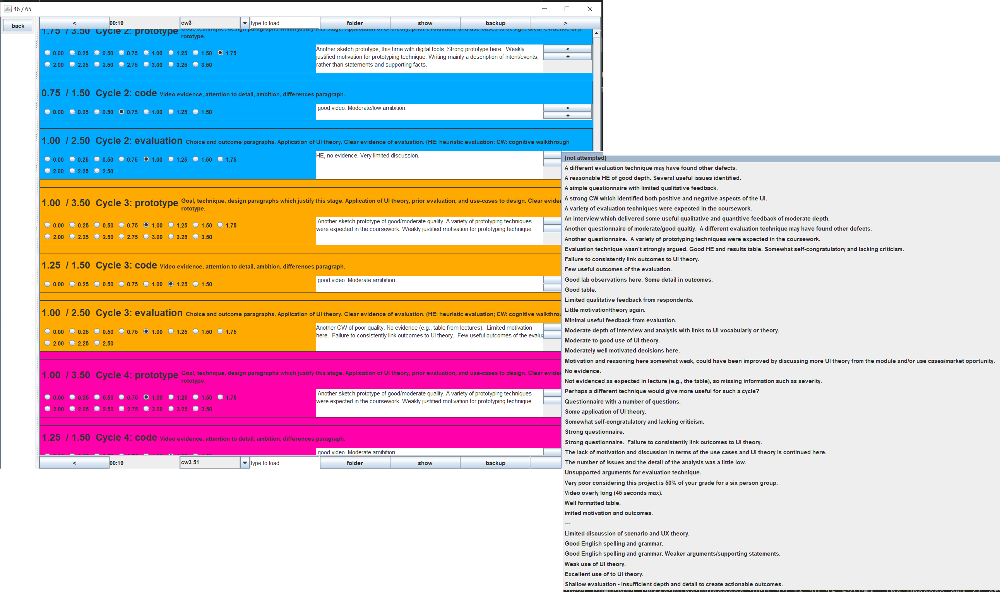

# Leeds' comp2811 grading software

Before gradescape but after the SoC started growing at +30% students/year...there was this.

Offline grader somewhat integrated with Minerva. Not official. Not a guide to future mark schemes. 
Probably only for those happy with hacking on my code at this point.

## Use

- download all the submissions from Minerva (grade centre, full grade centre, coursework column's down arrow, Assignment File Download)
- update main method of `Grader` to create the appropraite `assignment` and point it to the unzipped submissions
- run `Grader`
- use `<`, `>` to grade. Each time you flip page, a grade.xml file is written out.
- use `+`, `<` next to comment boxes to save/insert canned sentences
- download the grade CSV, (grade centre, Upload/Download, Download, Selected Column, Include Comments, Comma, Submit)
- run the main method in the appropriate `Assignment` subclass or/and (fixme) `ProcessOut` to generate html reports for the student/group and a zip of their work (needs tidying, and probably needs tweaking for this year's Minerva download format). It should be pointed to the CSV file and unzipped submissions root. 
- upload the CSV to Minerva
- upload these zips to OneDrive and use [https://github.com/twak/onedrive_bulk](https://github.com/twak/onedrive_bulk) to share the zips with the students
